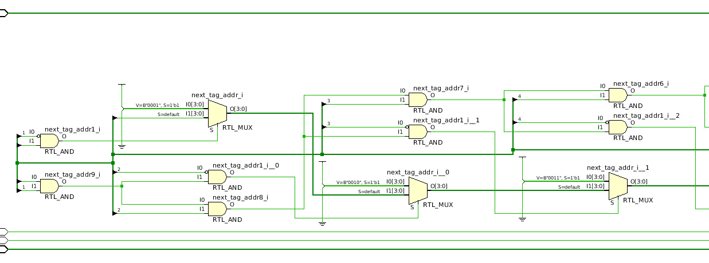
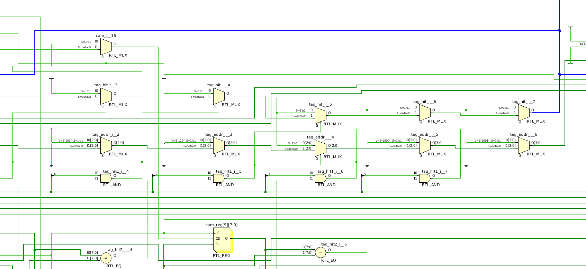
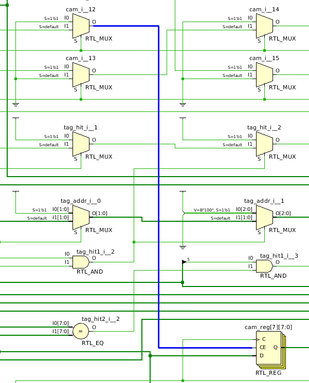
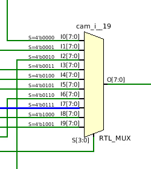

# Дополнение к лабораторной работе №13

Необходимо обновить модуль перифирии PS2, чтобы для пары "PS2-VGA" исправить следующие недочёты:
1. Позволить клавиатуре зажимать несколько клавиш одновременно. Первоначальная реализация берёт "сырые" данные с HID-контроллера.
   PS2 по умолчанию уведомляет о нажатии, зажатии и разжатии клавиши. Разжатие сопровождается сигналом 0xF0 до передачи скан-кода.
2. Фильтровать сигналы 0xF0, 0xAA - это спец. коды которые не должны распространяться до конечного устройства.

Ещё требовалось избежать отрисовки символов которые не имеют своего глифа в шрифте, однако это объективно надо делать программно, что тоже будет описано.

Для обработки зажатий нескольких клавиш вы можете:
1. Инициализировать память для состояний клавиш (50+ клавиш). Самый простой и рациональный метод.
2. Написать свою ассоциативную память для отслеживания состояния клавиш.

Мы не ищем лёгких путей (͡ ° ͜ʖ ͡ °).

```sv
module associative_memory #(
    parameter int WIDTH = 8,
    parameter int DEPTH = 10,
    parameter int ADDR_W = $clog2(DEPTH)
) (
    input  logic                clk_i,
    input  logic                rst_i,

    input  logic [ADDR_W - 1:0] addr_i,
    output logic                addr_hit_o,
    output logic [ WIDTH - 1:0] tag_o,

    input  logic [ WIDTH - 1:0] tag_i,
    input  logic                push_i,
    input  logic                pop_i,
    output logic                tag_hit_o,

    output logic                empty_o
);
```

`WIDTH` - ширина скан-кода клавиши. \
`DEPTH` - количество клавиш, которое можно одновременно зажать.

Напишем за одно скрипт проверки [tb_associative_memory.sv](./tb/tb_associative_memory.sv).

Обратите внимание как реализован поиск индекса свободной ячейки:

```sv
logic [ADDR_W - 1:0] next_tag_addr;
logic [DEPTH  - 1:0] and_vld;

always_comb begin
next_tag_addr = ADDR_W'('x);
and_vld       = DEPTH'('x);

for (int i = 0; i < DEPTH; i ++)
    if (i == 0)
        and_vld [i] = vld [i];
    else
        and_vld [i] = and_vld [i - 1] & vld [i];

for (int i = 0; i < DEPTH; i ++)
    if ((i == 0) &~ vld [0])
        next_tag_addr = ADDR_W'(i);
    else if (~vld [i] & (and_vld [i - 1]))
        next_tag_addr = ADDR_W'(i);
end
```

Чтобы синтезировать схему в RTL диаграмму, используйте Make:

```shell
$ make rtl TOP=associative_memory
```

RTL-синтез показывает совершенно неэффективный результат. Это тот самый момент когда проще сделать схему ручками на диаграмме, чем описать её через HDL.



Оно не стало оптимизировать как-либо крит-путь, например построив дерево из мультиплексоров, вместо этого они все соединены последовательно. Вероятно, это ещё может быть связано с тем что `and_vld` (в диаграмме верхние `RTL_AND`-ы) я описал как тоже последовательную схему.

```sv
if ((i == 0) &~ vld [0])
    next_tag_addr = ADDR_W'(i);
else if (~vld [i] & (and_vld [i - 1]))
    next_tag_addr = ADDR_W'(i);
```

Такая же история со схожим циклом для `tag_hit` и `tag_addr`:



Вполне вероятно, что синтез для FPGA значительно будет отличаться от синтеза диаграммы.

```sv
always_comb begin
tag_hit  = 1'b0;
tag_addr = ADDR_W'(0);

for (int i = 0; i < DEPTH; i ++)
    if (vld [i] & (cam [i] == tag_i)) begin
    tag_hit  = 1'b1;
    tag_addr = ADDR_W'(i);
    end
end
```

Ещё забавно, что сигнал сброса Clock Enable генерируется через мультиплексор, контролируемый сигналом `rst_i` (см. `cam_i__12`), несмотря на то, что в описанном коде не было ни одного сброса памяти `cam`.



Обращение к памяти по индексу реализованы через большой мультиплексор.



После модификации [ps2_sb_ctrl.sv](./rtl/peripheral/ps2_sb_ctrl.sv), можно проверить работоспособность подключив
клавиатуру к USB порту платы, и используя следующую программу:

```c
#include "peripheral.h"
#include "platform.h"
#include <stdbool.h>
#include <stdint.h>

#define CHARS_CNT 960

void tx_write(const char *str) {
  char c;
  while ((c = *str++) != '\0') {
    while (tx_ptr->busy);
    tx_ptr->data = (uint32_t)(c);
    while (tx_ptr->busy);
  }
}

uint32_t idx = 0;
static uint32_t ascii_map[] = {
  0x00000000, 0x00000000, 0x00000000, 0x007E0900, 0x00000000, 0x00317100,
  0x737A0000, 0x00327761, 0x64786300, 0x00333465, 0x66762000, 0x00357274,
  0x68626E00, 0x00367967, 0x6A6D0000, 0x00383775, 0x696B2C00, 0x0039306F,
  0x6C2F2E00, 0x002D703B, 0x00270000, 0x00003D5B, 0x5D0D0000
};

void int_handler(int mcause) {
  uint32_t scancode = ps2_ptr->scan_code;
  if (scancode >= sizeof(ascii_map) * 4)
    return;

  char ascii_code = ((uint8_t *)ascii_map)[scancode];
  if (vga.tiff_map[ascii_code * 16 + 7] == 0b00111111) {
    tx_write("Got empty symbol\n");
    return;
  }

  vga.char_map[idx] = ascii_code;
  idx = idx >= CHARS_CNT - 1 ? 0 : idx + 1;
}

int main() {
  // Enable PS2 interrupts only
  __asm__ volatile("csrw mie, %0" : : "r"(1 << (0x10 + PS2_INT_IDX)));
  tx_ptr->baudrate = 115200;

  // Waiting if switch [0] is ON.
  led_ptr->value |= (1 << 0);
  while (((sw_ptr->value) & (1 << 0)) != 0);
  led_ptr->value &= ~(1 << 0);

  tx_write("Initialized successfully\n");
  while (true);
};
```

Имейте ввиду, что клавиатура имеет свои особенности: ограничения по количеству зажатых клавиш, некоторые нетипичные символы могут быть интерпретированы неправильно адаптором Nexys A7, из-за чего потом невозможно
будет "отжать" несуществующую на клавиатуре клавишу.
